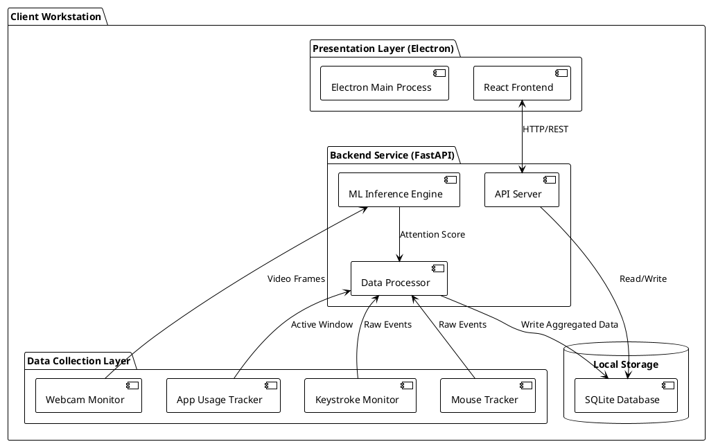
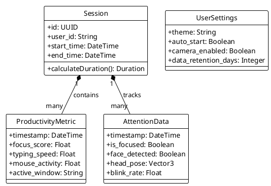
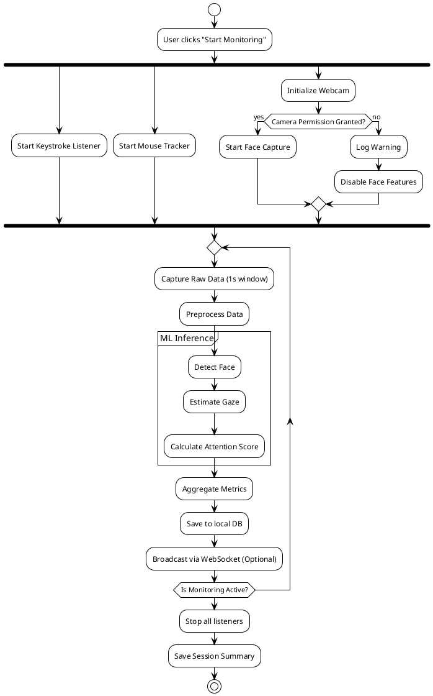
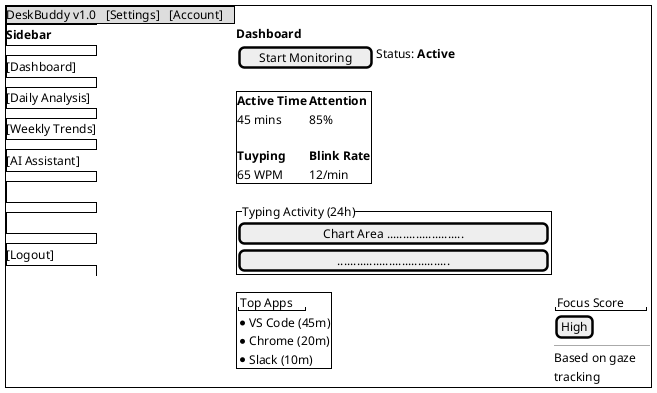

# DeskBuddy Project Diagrams

This document contains PlantUML code for the system diagrams. You can render these using any PlantUML viewer or editor extension.

## 1. System Architecture (Component Diagram)

This diagram illustrates the high-level interaction between the Data Collection, Backend, and Frontend layers.



## 2. Design Level Diagrams

### A. Class Diagram (Data Models)
Represents the core data structures used in the backend and frontend types.



### B. Sequence Diagram (Dashboard Data Flow)
Shows the sequence of events when a user opens the dashboard and data is fetched.

```plantuml
@startuml
!theme plain
autonumber

actor User
participant "React Frontend" as UI
participant "API Service" as Service
participant "FastAPI Backend" as Backend
database "SQLite DB" as DB

User -> UI : Opens Dashboard
activate UI

UI -> Service : fetchDashboardData()
activate Service

parallel {
    Service -> Backend : GET /analytics/daily
    Service -> Backend : GET /activity/keystrokes
    Service -> Backend : GET /activity/app_usage
}

activate Backend
Backend -> DB : Query Aggregated Stats (Day)
activate DB
DB --> Backend : Return Data
deactivate DB

Backend --> Service : JSON Response
deactivate Backend

Service --> UI : Update State (productivity, charts)
deactivate Service

UI -> UI : Render Charts & Cards
UI --> User : Display Dashboard

deactivate UI
@enduml
```

### C. Activity Diagram (Monitoring Session)
Details the logic flow of the background monitoring process.



## 3. User Interface Diagram (Wireframe)

A high-level mockup of the application layout using PlantUML Salt.


